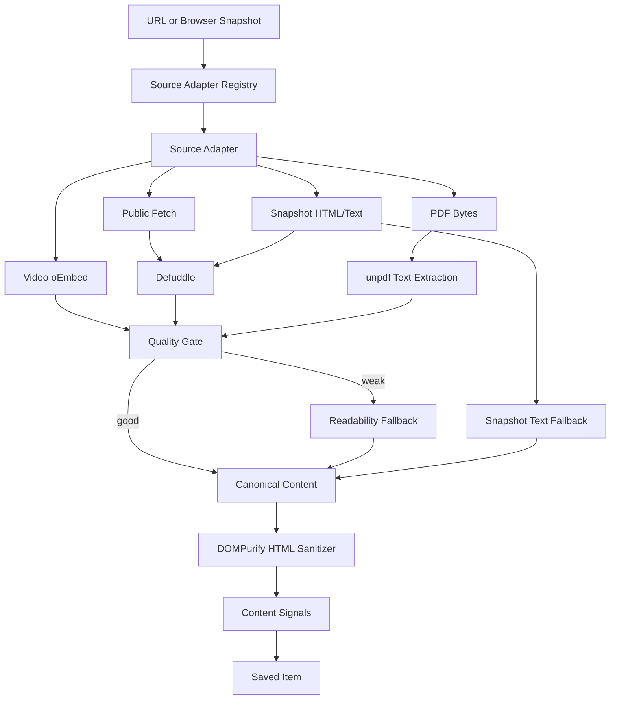

# Content Recognition Design

## Goal

Huntter should capture what the user actually meant to save, not merely store a URL preview. The recognition pipeline must be deterministic, fast enough for background processing, and honest about capture quality.

AI is intentionally out of scope for the current system. Summary, tags, reading time, cover image, and confidence are Content Signals derived from captured content.

## Library Decision

Primary parser: Defuddle.

- It is designed for web-clipper style use cases.
- It extracts cleaned content, title, author, site, favicon, image, language, publication date, schema.org data, and word count.
- It can run in Node with a DOM implementation, which fits the current JSDOM-based API.
- Current review: Defuddle's own documentation positions it for extracting main content from local HTML/URLs and notes it was created for Obsidian Web Clipper, which matches Huntter's extension-first model.

Fallback parser: Mozilla Readability.

- It is stable and widely used for reader-mode extraction.
- It remains valuable when Defuddle fails or returns low-signal output.
- Current review: Mozilla Readability remains a small, well-understood fallback that accepts a DOM document and works with JSDOM.

Sanitizer: DOMPurify.

- Parser output is still untrusted markup.
- DOMPurify officially supports server-side Node usage with jsdom and can restrict output to the HTML profile.
- Huntter sanitizes `contentHtml` before storage, forbids style tags/attributes, and enables named property isolation.

PDF parser: unpdf.

- It wraps PDF.js for text extraction across Node, browser, and serverless runtimes.
- It is a modern alternative to the older `pdf-parse` package.
- Huntter uses it only for first-pass text extraction; scanned/image-heavy PDFs remain a future OCR adapter.

Video metadata: oEmbed.

- YouTube and Vimeo expose public oEmbed metadata suitable for title, author, provider, and thumbnail capture.
- Huntter treats oEmbed video results as `partial`: metadata is not the transcript, comments, chapter list, or full content.
- Transcripts should become a future source-specific adapter rather than being guessed from page HTML.

Avoid for now: Postlight/Mercury parser.

- It has useful custom-parser ideas, but adds more legacy surface area than the current product needs.
- If Huntter later needs source-specific CSS selectors, implement them as Source Adapters rather than adopting a broad parser framework.

## Pipeline

## Canonical Content

Canonical Content is the normalized extraction output:

- URL and canonical URL.
- Title and source name.
- Source type.
- Excerpt and readable text.
- Sanitized content HTML when available.
- For browser selection, Canonical Content HTML is generated from the selected passage instead of a parser's guessed full page.
- For browser snapshot fallback, Canonical Content HTML uses sanitized focused snapshot HTML when it contains substantial text, otherwise it falls back to escaped readable text.
- Cover image, favicon, author, publication time, language, and word count.
- Extractor provenance: `defuddle`, `readability`, `browser_selection`, `browser_snapshot`, or `metadata`.
- Confidence and Extraction State.
- Recognition Version, recognized timestamp, and Content Hash for parser upgrades and reprocessing comparisons.

## URL Identity Rules

Canonical URLs remove hash fragments and known tracking parameters such as `utm_*`, `fbclid`, `gclid`, `msclkid`, and newsletter campaign IDs. Meaningful query parameters such as `id`, `page`, and `q` are preserved and sorted. This keeps duplicate captures from marketing links together without collapsing distinct resources.

## Quality Rules

- Prefer user-selected text when it is substantial, and skip expensive full-page parser work for that capture.
- Prefer Defuddle text over Readability text when it contains meaningful content.
- Prefer Readability over raw snapshot text to avoid navigation and sidebar noise.
- Use snapshot text when logged-in content cannot be fetched publicly.
- Use metadata only as a shallow fallback and mark the item as `partial`.
- Validate Source Adapter output before item building so invalid URLs, unsafe `contentHtml`, fake `ready` states, fake `failed` states, and incomplete connector-required states fail loudly.
- Parse all JSON-LD scripts and `@graph` structures by selecting Article-like nodes before generic WebSite/Breadcrumb nodes.
- Prefer structured titles and images from Open Graph, Twitter Card, and Article JSON-LD before generic document titles.
- Score cover images through the shared Cover Image module so logos, favicons, sprites, placeholders, and avatars do not beat article, Open Graph, structured-data, source-specific, or oEmbed images.
- Keep the quality gate pure and tested in `server/sources/contentQuality.ts`.
- Run Mozilla Readability only when selected text and Defuddle output are below quality thresholds.

## Browser Snapshot Rules

The extension does not blindly store the first chunk of the full page DOM. It chooses a focused content root first:

- Prefer the selected text's nearest `article`, `main`, or `[role=main]` ancestor.
- Otherwise score common article containers by text, paragraphs, and images.
- Fall back to `body` only when no useful content root exists.
- Serialize metadata-rich `<head>` elements plus the focused root HTML, capped by size.
- Prefer images from the focused root before page-wide image candidates.

This gives private, logged-in, and dynamic pages better Canonical Content without increasing API payload size.

## Source Rules

- Generic public pages: selected text fast path -> bounded HTML fetch -> Defuddle -> Readability -> snapshot -> metadata.
- Feishu/Lark: browser snapshot can produce `ready` when substantial visible content is captured, or `partial` when limited; OAuth authorization plus direct docx raw-content import is available, while wiki resolution and full native block fidelity remain future connector work.
- X/Twitter: public oEmbed, selected text, or visible browser snapshot content; private bookmarks, full author fidelity, and thread expansion require a Connector.
- PDFs: first-class Source Adapter using `unpdf`; text PDFs can become `ready`, limited/scanned PDFs remain `partial` or `failed` until OCR exists.
- Videos: first-class Source Adapter using public oEmbed for metadata; transcripts remain future work.
- Other structured tools should become first-class Source Adapters instead of being forced into generic web parsing.

## Performance

- API save returns a queued item quickly.
- Recognition runs in the background.
- The web client does not poll; the user refreshes with Reload.
- Extension snapshots are capped before being posted to the local API.
- Public HTML fetch timeout, response content type, and response byte size are bounded before parser work begins.
- PDF fetch size is bounded before extraction.
- Defuddle runs with `useAsync: false` so recognition does not trigger hidden third-party fetches.
- Strong browser selections skip Defuddle and Readability for generic web pages. Readability fallback is lazy; strong Defuddle results also skip the extra parse.

## HTML Safety

Canonical Content stores sanitized `contentHtml` when parser HTML, browser selection, or browser snapshot content is available. The sanitizer uses DOMPurify with the HTML profile, forbids `style`, and isolates named properties. Browser-selected text is converted to escaped paragraph HTML. Browser snapshot HTML is stored only when its body text is substantial enough; otherwise Huntter falls back to escaped readable text so logged-in app shells do not become empty Canonical Content. The web client renders `contentHtml` inside a sandboxed reader iframe, without script, form, popup, or same-origin privileges.

## Content Signals

Content Signals are built in `server/contentSignals.ts`. The module uses Sanitized Content HTML structure when available, so summaries prefer the first real paragraph instead of nav/sidebar text. Tags are deterministic weighted keywords from source type, domain, title, headings, paragraphs, and readable text, with low-signal UI words filtered out. Reading time is derived from captured content word count and stays independent from user notes or workflow fields.

## Reprocessing Metadata

Every queued or recognized Saved Item carries the current `recognitionVersion` and a SHA-256 `contentHash` over Canonical Content fields. Completed recognition also records `recognizedAt`, `recognitionDurationMs`, and `recognitionTiming` with Source Adapter, Content Signals, and item-build phase timing. The repository stores internal, size-bounded `captureInput`, and recognition jobs use the same bounded snapshot input, so manual refresh and future parser upgrades can re-run against the original URL/snapshot without exposing large snapshots through the API or bloating transient job storage. These fields let future migrations answer:

- Which items were produced by an old recognition pipeline.
- Whether a parser or sanitizer change actually changed Canonical Content.
- Whether reprocessing can preserve user workflow fields while replacing only recognition output.
- Whether permissioned browser-snapshot captures can be refreshed without degrading to URL-only `needs_connector`.
- Whether duplicate saves preserved the strongest available capture input for future refresh.
- Which parser paths are becoming slow enough to require thresholds, queue tuning, or Source Adapter optimization.
- Whether latency comes from Source Adapter work, Content Signals, or item assembly.

Capture Events provide the operational audit trail around those fields. They record queued captures, recognition outcomes, manual refresh outcomes, snapshot byte size, result state, timing, content hash, and error context without storing raw browser snapshot HTML or text in the event stream.

## Test Fixtures To Add

- Static public article HTML with Open Graph image. Done.
- Article with JSON-LD `@graph` and multi-script title, image, author, and date selection. Done.
- Noisy page with nav/sidebar where Defuddle should beat raw snapshot text. Done.
- URL normalization and canonical dedupe for tracking parameters. Done.
- Browser extension focused content-root snapshot extraction. Done.
- Logged-in style page where snapshot text is the only useful content. Done.
- PDF text extraction through the PDF Source Adapter. Done.
- YouTube/Vimeo oEmbed metadata through the Video Source Adapter. Done.
- Feishu/Lark URL without snapshot -> `needs_connector`.
- Feishu/Lark URL with limited snapshot -> `partial`; substantial snapshot -> `ready`.
- X public oEmbed, selected-text fallback, browser snapshot fallback, and oEmbed failure. Done.
- Refresh recognition using stored capture input while preserving status, favorite, note, and user tags. Done.
- Capture input storage budget for large snapshots. Done.
- Public HTML fetch boundary tests for content type and size limits. Done.
- Recognition metadata tests for stable SHA-256 content hashes and pipeline version. Done.
- Recognition timing tests for total, Source Adapter, Content Signals, and item-build phase durations. Done.
- Quality gate tests for selected-text fast path, parser selection, lazy Readability fallback, metadata-only partial state, and browser snapshot fallback. Done.
- Content HTML sanitizer test for scripts, event handlers, JavaScript URLs, style attributes, SVG, and named property isolation. Done.
- Cover Image scoring tests for structured data, Open Graph/oEmbed/source-specific images, and low-quality logo/avatar/sprite rejection. Done.
- Browser golden reader assertion for sandboxed Canonical Content HTML display. Done.
- Installed Chrome extension golden for real MV3 background capture, visible popup Save, manual Reload, Capture Events, and no public snapshot leakage. Done.
- Desktop/mobile visual golden for seeded ready and connector-needed states, reader content, Capture Events, screenshot artifacts, and no horizontal overflow. Done.
- Content Signals tests for HTML-structured summary, low-signal tag filtering, CJK text, and reading time. Done.
- Extracted Content contract tests for required fields, state invariants, confidence, URL fields, and `contentHtml` safety. Done.
- Capture Event tests for event shape, snapshot byte accounting, SQLite persistence, API exposure, and no raw snapshot text leakage. Done.
