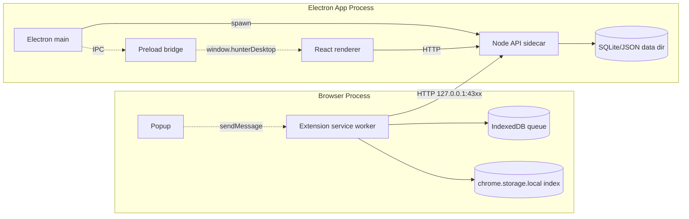

# Hunter Desktop + Offline 架构

本文记录 Hunter 的 Electron 桌面壳、Node API sidecar、浏览器扩展离线队列，以及三者之间的发现和同步协议。

## 实现状态

| 模块                                                                           | 状态 | 测试/验证                                   | 备注                                                                                      |
| ------------------------------------------------------------------------------ | ---- | ------------------------------------------- | ----------------------------------------------------------------------------------------- |
| 扩展 queue.js（IndexedDB + storage 索引 + 容量保护 + lease）                   | 完成 | `pnpm test:queue`                           | `extension/src/queue.js`, `extension/tests/queue.test.ts`                                 |
| 扩展 saveActions.js（performSave / flushQueue / tryPost / pingHealth）         | 完成 | `pnpm test:save-actions`                    | `extension/src/saveActions.js`                                                            |
| 扩展 apiBase.js（4317-4319 探活 + TTL 缓存）                                   | 完成 | `pnpm test:api-base`                        | 自定义 off-list localhost base 会优先于默认端口                                           |
| 扩展 background.js（alarms / onStartup / tabs.onUpdated / 上下文菜单 / badge） | 完成 | `pnpm golden:extension`                     | 所有保存入口都带 snapshot；supported-resource gate 当前关闭，待算法重做                   |
| Server 端口范围回退 + stdout 握手                                              | 完成 | `pnpm test:listen`                          | `HUNTER_API_PORT=<port>` 是桌面壳解析的机器可读握手                                       |
| Server 数据目录抽象（`HUNTER_DATA_DIR`）                                       | 完成 | `pnpm test:data-dir`                        | Electron dev 使用 repo `./data/`，packaged app 使用 OS userData 目录                      |
| Electron shell（main/preload + sidecar supervisor + IPC API base）             | 完成 | `pnpm check`, manual smoke                  | `electron/main.cjs`, `electron/preload.cjs`, `electron/dev.mjs`                           |
| Electron 登录自启开关                                                          | 完成 | `pnpm check`                                | 前端 `useAutostart` 通过 preload bridge 调用 Electron LoginItem API；dev shell 隐藏该设置 |
| Electron 打包配置                                                              | 完成 | `pnpm electron:dir` / `pnpm electron:build` | `electron-builder`，资源来自 `electron/resources`                                         |
| 产品级签名/公证/自动更新                                                       | 未做 | -                                           | 仍属于 release 工程，不影响本地 dev                                                       |
| 历史数据迁移（旧 dev `cwd/data/` -> OS userData）                              | 未做 | -                                           | dev 继续共享 `./data/`；packaged 首次启动会使用 Electron userData                         |

## TL;DR

- `pnpm dev` 启动 Electron dev orchestrator：先启动 Vite，再打开 Electron 窗口；Electron main 同时启动 Node API sidecar。
- API sidecar 在 `4317 -> 4318 -> 4319` 中选择第一个可用端口，启动后向 stdout 写 `HUNTER_API_PORT=<port>`。
- Electron preload 暴露最小 bridge：`getApiBase`、`onApiReady`、`isAutostartAvailable`、`getAutostart`、`setAutostart`。React 不直接访问 Node 或 Electron internals。
- 浏览器扩展不读桌面壳内部状态，只探活 `127.0.0.1:4317-4319`，因此 Electron 与扩展之间没有文件路径耦合。
- Capture 仍然只能来自浏览器 snapshot；桌面壳只负责进程生命周期和本地 API 发现，不参与内容识别。

## 1. 系统总览



信任边界：

- 浏览器扩展到本地 API：HTTP，仅绑定 `127.0.0.1`。扩展通过 `/api/health` 探活，并读取 `owner` / `startedAt` 来区分同机多个 Hunter sidecar；默认自动模式优先 packaged Electron sidecar，其次 dev Electron sidecar，再其次 standalone API。用户明确配置的 API base 仍按手动配置优先。
- Electron main 到 Node sidecar：父子进程，通过 stdout 单行端口握手。
- React renderer 到 Electron main：preload 暴露的受控 IPC bridge，renderer 不启用 Node integration。

## 2. Electron 桌面壳

### 2.1 运行入口

- `pnpm dev` -> `tsx electron/dev.mjs`
- `electron/dev.mjs` 启动 `pnpm dev:web`，等待 `http://127.0.0.1:5173` 可访问，然后启动 Electron。
- `electron/main.cjs` 先启动 API sidecar，等到端口握手或 10 秒超时后创建 native window，并根据环境加载：
  - dev: `http://127.0.0.1:5173`
  - packaged: `dist/index.html`

packaged app 通过 `file://` 读取 `dist/index.html`，所以 Vite production build 必须使用相对资源路径。`vite.config.ts` 设置 `base: "./"`，确保 JS、CSS、字体和 brand assets 从 app asar 内的相对路径加载，而不是错误解析到文件系统根目录 `/assets/...`。

### 2.2 Sidecar 启动

Electron main 使用当前 Electron 二进制的 Node 模式运行 API：

```text
ELECTRON_RUN_AS_NODE=1 <electron-binary> node_modules/tsx/dist/cli.mjs server/index.ts
```

packaged app 使用同一个运行时执行打包后的 `server.cjs`：

```text
ELECTRON_RUN_AS_NODE=1 <electron-binary> <resources>/server.cjs
```

传给 sidecar 的关键环境变量：

- `HUNTER_PORT_RANGE=4317-4319`
- `HUNTER_REPOSITORY=sqlite`
- `HUNTER_DATA_DIR=<resolved data dir>`

Electron main 读取 stdout，解析第一条 `HUNTER_API_PORT=<port>`，然后：

1. 写入内存态 `apiBase = http://127.0.0.1:<port>`。
2. 通过 `hunter:api-ready` IPC 通知 renderer。
3. 继续转发 sidecar stdout/stderr，失败不静默吞掉。

### 2.3 数据目录

- dev：`<repo>/data`，保持开发数据和现有 fixtures 连续。
- packaged：`app.getPath("userData")`，由 Electron 解析 OS 标准目录。

服务端只读取 `HUNTER_DATA_DIR`，不自己猜 OS 路径。这样测试可以传入临时目录，桌面壳也可以在未来做显式迁移。

### 2.4 退出和孤儿进程

Unix/macOS 下 sidecar 以 detached process group 启动；Electron 正常退出或收到 `SIGINT` / `SIGTERM` 时都会向整个 process group 发 `SIGTERM`，避免 `tsx` 的子 Node 进程残留。Windows 下使用 `taskkill /T /F` 清理进程树。

服务端仍保留 data-dir lock。如果异常退出导致旧 sidecar 残留，新 sidecar 会在绑定端口前检测锁并失败，避免多个进程同时写同一份 JSON/SQLite 数据。

## 3. Preload Bridge

`electron/preload.cjs` 暴露：

```ts
window.hunterDesktop = {
  getApiBase(): Promise<string | null>,
  onApiReady(listener): () => void,
  isAutostartAvailable(): Promise<boolean>,
  getAutostart(): Promise<boolean>,
  setAutostart(enabled: boolean): Promise<boolean>
}
```

React 侧只通过 `src/lib/desktopBridge.ts` 访问这个对象：

- `src/lib/api.ts`：桌面环境使用 bridge 获取 absolute API base；浏览器环境保持相对 `/api`。
- `src/hooks/useAutostart.ts`：packaged 桌面环境显示登录自启开关；dev、浏览器和 golden 环境隐藏。

## 4. 扩展离线队列

扩展保存入口保持不变：

- toolbar popup
- context-menu "Save page"
- background save-tab pipeline

所有入口生成 browser snapshot 后直接 POST 到本地 API；supported-resource gate 当前通过 `CONTENT_SUPPORT_GATE_ENABLED=false` 关闭，待算法重做。在线时直接 POST 到本地 API；离线或 API 不可达时入 IndexedDB 队列。flush 由 alarm/startup/tab update/popup 触发，并通过 `chrome.storage.local` lease 降低并发重复 POST。

幂等保障：

- 扩展 queue 侧按 canonical URL 替换 payload。
- 服务端 `upsertQueued` 按 canonical URL 合并 queued item。

因此 service worker 中途被杀或 lease race 最坏只会重复 POST 一次，不会产生重复 item。

## 5. 打包

`pnpm server:bundle` 输出：

- `electron/resources/server.cjs`
- `electron/resources/server.cjs.map`
- `electron/resources/runtime/node_modules`

`pnpm electron:dir` 构建 unpacked app，适合本地 smoke。`pnpm electron:build` 交给 `electron-builder` 产出当前平台安装包。

打包时 `electron-builder` 会把 `electron/resources/server.cjs` 放到 app `Resources/server.cjs`，并把 `electron/resources/runtime/node_modules` 放到 app `Resources/node_modules`。这让 `server.cjs` 的外部依赖解析走 Node 默认规则，不需要额外设置 `NODE_PATH`。

当前 release 工程仍未覆盖：

- macOS code signing + notarization
- Windows Authenticode
- auto-updater
- 旧数据目录迁移

## 6. 验证

迁移 Electron 壳后至少运行：

- `pnpm check`
- `pnpm lint`
- `pnpm format:check`
- `pnpm test:listen`
- `pnpm test:data-dir`
- `pnpm test:api-base`
- `pnpm server:bundle`
- `pnpm electron:dir`
- packaged smoke：启动 `release/mac-arm64/Hunter.app/Contents/MacOS/Hunter`，断言 preload bridge 存在、`getApiBase()` 返回 `127.0.0.1:4317-4319`、renderer 没有 Node globals、Library UI 可见、且没有 `ERR_FILE_NOT_FOUND` 资源加载错误

完整本地 gate 仍是 `pnpm verify`。Golden journeys 继续自行启动隔离 API/web fixture，不依赖 `pnpm dev` 已经运行。
