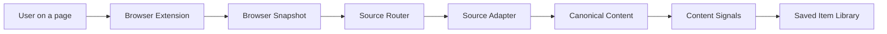

# Hunter System Redesign

## The Correction

The first implementation treated every source as a URL that could be fetched and parsed. That is too narrow for the product. Hunter should manage information from many semi-closed sources: Feishu, X, Notion, Reddit, WeChat, newsletters, forums, PDFs, and ordinary web pages.

The redesigned system is source-first and snapshot-only:

## Capture Model

Capture happens through a single path: the browser extension produces a snapshot of the currently visible page and posts it to the local API. `POST /api/items` rejects requests without a snapshot.

The extension captures:

- URL and canonical URL.
- Page title.
- Visible text.
- Selected text.
- Focused content-root HTML snapshot.
- Metadata and image candidates.
- Favicon.

Logged-in, permissioned, and dynamic pages succeed because the snapshot reflects whatever the user's session can already see.

## Source Adapter Interface

Every source adapter answers two questions against the snapshot:

1. Can I handle this URL?
2. What extraction state did I produce from the snapshot?

Current adapters:

- `feishu`: detects Feishu/Lark URLs and quality-gates the snapshot into `ready` or `partial`.
- `x`: recognizes X post URLs from selected text or DOM snapshots, otherwise marks the item `partial`.
- `pdf`: turns the rendered PDF viewer's snapshot text into Canonical Content.
- `video`: recognizes YouTube/Vimeo watch pages from the snapshot title, site name, and visible text.
- `generic-web`: uses the selected-text fast path, then Defuddle on the snapshot HTML, then Readability fallback, then metadata, with shared cover scoring.

## Extraction States

- `processing`: queued and waiting for recognition.
- `ready`: content is good enough to summarize and organize.
- `partial`: some content was captured, but the system should disclose the limitation.
- `failed`: an unexpected failure happened or the snapshot had no usable content.

## Implementation Status

Implemented now:

- Source adapter seam.
- Generic web adapter.
- X adapter.
- Feishu-aware adapter.
- PDF adapter for text PDFs.
- Video adapter for YouTube/Vimeo snapshots.
- Honest `processing`, `ready`, `partial`, and `failed` states.
- Snapshot-required `POST /api/items` schema.
- Fast queued save path with manual Reload.
- Deterministic local content signals with no AI dependency.
- Repository seam over the current JSON adapter.
- Opt-in SQLite adapter with indexes and FTS maintenance.
- Server-side search, source filtering, and pagination for the library.
- Durable recognition jobs for JSON and SQLite adapters.

Not implemented yet:

- Snapshot-driven richer block rendering for Feishu, Notion, and similar structured tools.
- Snapshot-derived transcripts for video and audio pages.
- OCR for image-heavy PDFs.
