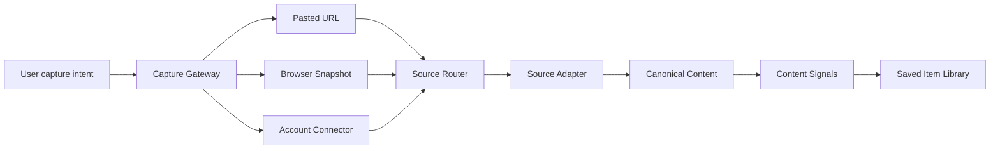

# Huntter System Redesign

## The Correction

The first implementation treated every source as a URL that could be fetched and parsed. That is too narrow for the product. Huntter should manage information from many semi-closed sources: Feishu, X, Notion, Reddit, WeChat, newsletters, forums, PDFs, and ordinary web pages.

The redesigned system is source-first:



## Capture Modes

### URL Capture

Best for public pages and embeddable posts.

Examples:

- Public articles.
- Public X posts through oEmbed.
- Public forum posts.

Failure mode:

- If the source needs login or dynamic rendering, URL capture should return `needs_connector` or `partial`, not fake success.

### Browser Snapshot Capture

Best for content the user can currently see in their browser.

The extension captures:

- URL and canonical URL.
- Page title.
- Visible text.
- Selected text.
- Focused content-root HTML snapshot.
- metadata and image candidates.
- favicon.

This is the default path for logged-in pages where the user's browser already has access.

### Connector Capture

Best for structured, permissioned sources.

Examples:

- Feishu documents.
- Notion pages.
- Google Docs.
- Slack messages.

The connector should use OAuth or platform authorization, read the platform's native block/message structure, and import it as canonical content.

## Source Adapter Interface

Every source adapter answers three questions:

1. Can I handle this URL?
2. Which capture mode do I need?
3. What extraction state did I produce?

Current adapters:

- `feishu`: detects Feishu/Lark URLs, quality-gates browser snapshots into `ready` or `partial`, otherwise returns `needs_connector`.
- `x`: resolves public X posts through bounded `publish.twitter.com/oembed`, with selected-text and browser-snapshot fallbacks.
- `pdf`: extracts text from PDF URLs with `unpdf`, with browser snapshot fallback when direct extraction fails.
- `video`: resolves YouTube/Vimeo public oEmbed metadata and marks it `partial` because metadata is not a transcript.
- `generic-web`: uses selected text fast path, Defuddle, Readability fallback, metadata, shared cover scoring, and server fetch or browser snapshot.

Permissioned source failures carry `requiredConnector` so the product can show the correct Feishu/X integration state instead of treating the item as a generic parse failure.

## Extraction States

- `ready`: content is good enough to summarize and organize.
- `partial`: some content was captured, but the system should disclose the limitation.
- `needs_connector`: URL or snapshot is not enough; source authorization is required.
- `failed`: an unexpected failure happened.

## Feishu Strategy

Feishu is not a generic web page. Treat it as a structured source.

MVP behavior:

- Pasted Feishu URL: create a Saved Item with `needs_connector`.
- Open Feishu page + browser extension: capture visible content as `ready` when substantial, or `partial` when limited.
- UI must explain that full import needs a Feishu connector.

Future connector behavior:

- Detect doc/wiki/docx token from URL.
- Use Feishu authorization. Done for OAuth authorization and encrypted token storage.
- Refresh expired access tokens before sync. Done for manual connector sync.
- Read document raw content from official APIs. Done for direct `/docx/{document_id}` URLs.
- Resolve wiki indirection before import. Done for wiki nodes that resolve to docx.
- Read document blocks from official APIs.
- Convert blocks into Huntter canonical content.
- Import images, attachments, titles, authors, and permissions where allowed.

## Product Implication

The main user experience should not be "paste URL and hope." It should be:

```text
Save from page when viewing content.
Connect accounts for structured/private sources.
Use URL capture only when the source supports public parsing.
```

## Implementation Status

Implemented now:

- Source adapter seam.
- Generic web adapter.
- X adapter.
- Feishu-aware adapter.
- PDF adapter for text PDFs.
- Video adapter for YouTube/Vimeo oEmbed metadata.
- Honest `ready`, `needs_connector`, and `partial` states.
- Fast queued save path with manual Reload.
- Deterministic local content signals with no AI dependency.
- Repository seam over the current JSON adapter.
- Opt-in SQLite adapter with indexes and FTS maintenance.
- Server-side search, source filtering, and pagination for the library.
- Durable recognition jobs for JSON and SQLite adapters.
- Connector definitions, connector-state storage, connector-state API mutations, explicit unsupported sync responses, and connector-state UI for JSON and SQLite adapters.
- Feishu OAuth authorization start/callback, PKCE state handling, account label lookup, and encrypted local token storage.
- Feishu access-token refresh before manual connector sync.
- Feishu direct docx raw-content import for saved URL-only connector-needed items.
- Feishu wiki node resolution for saved wiki URLs that resolve to docx.

Not implemented yet:

- Feishu non-docx wiki import.
- Permission refresh.
- Full source-specific block rendering.
- Background sync/import for connected sources.
- X OAuth connector.
