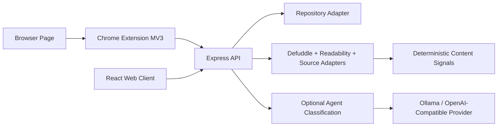

# Hunter Technical Design

## Architecture



## Project Layout

- `src/`: React/Vite web client.
- `server/`: Express API, Repository seam, JSON adapter, content recognition, and content signals.
- `server/repository.ts`: storage-facing interface for list, patch, delete, queued upsert, recognition result replacement, jobs, and Capture Events.
- `server/recognitionJobs.ts`: durable background recognition runner triggered on startup and enqueue.
- `server/repositories/jsonRepository.ts`: default development adapter.
- `server/repositories/sqliteRepository.ts`: opt-in local-first adapter with indexes and FTS maintenance.
- `shared/`: shared TypeScript types.
- `extension/`: Chrome Manifest V3 extension.
- `docs/`: product and technical design.

## Data Model

```ts
type LibraryItem = {
  id: string;
  url: string;
  canonicalUrl: string;
  title: string;
  sourceName: string;
  sourceType: "article" | "post" | "tweet" | "feishu" | "video" | "pdf" | "other";
  status: "unread" | "reading" | "read" | "archived";
  favorite: boolean;
  tags: string[];
  note?: string;
  summary: string;
  excerpt: string;
  readableText?: string;
  contentHtml?: string;
  coverImage?: string;
  favicon?: string;
  author?: string;
  publishedAt?: string;
  language?: string;
  wordCount?: number;
  savedAt: string;
  updatedAt: string;
  readingMinutes: number;
  confidence: number;
  enrichmentState: "processing" | "ready" | "partial" | "failed";
  sourceMessage?: string;
  recognitionVersion?: number;
  recognizedAt?: string;
  recognitionDurationMs?: number;
  recognitionTiming?: {
    totalMs: number;
    sourceAdapterMs: number;
    contentSignalsMs: number;
    itemBuildMs: number;
  };
  contentHash?: string;
  extractor?: string;
};

type CaptureEvent = {
  id: string;
  itemId?: string;
  sourceUrl: string;
  canonicalUrl?: string;
  sourceType?: "article" | "post" | "tweet" | "feishu" | "video" | "pdf" | "other";
  snapshotBytes: number;
  resultState: "processing" | "ready" | "partial" | "failed";
  recognitionVersion?: number;
  recognitionDurationMs?: number;
  contentHash?: string;
  error?: string;
  createdAt: string;
};
```

## API

- `GET /api/health` returns `{ ok, service: "hunter-api", owner, startedAt, pid }` so local clients can distinguish competing sidecars during discovery.
- `GET /api/items?q=&filter=&sourceType=&limit=&offset=`
- `POST /api/items` (snapshot required)
- `PATCH /api/items/:id`
- `DELETE /api/items/:id`
- `POST /api/items/:id/enrich`
- `GET /api/capture-events?limit=`
- `GET /api/agent/local-llm`
- `GET /api/agent/settings`
- `PATCH /api/agent/settings`
- `POST /api/agent/items/:id/classify`

`POST /api/items` requires a `snapshot` payload from the browser extension and returns 400 when it is missing. There is no longer any server-side URL fetch or connector entry point.

`GET /api/items` returns the current page, global library stats, and page metadata. JSON and SQLite adapters share the same query semantics; SQLite executes search through FTS.

`GET /api/capture-events` returns recent Capture Event diagnostics. Events include source URL, snapshot byte count, result state, timing, and error context, but never raw browser snapshot HTML or text.

Agent endpoints are optional and isolated from recognition. `GET /api/agent/settings` and `PATCH /api/agent/settings` manage the local provider configuration used by the Settings modal; raw API keys are stored server-side and never returned to the renderer. `GET /api/agent/local-llm` reports configured provider reachability and selected model availability. `POST /api/agent/items/:id/classify` sends already-captured item fields to the configured model, schema-validates the classification/understanding JSON, stores it on the item as `agentClassification`, and returns the updated public item. `POST /api/agent/items/classify-missing` incrementally classifies only ready/partial items with missing or stale content categories, one model call per item. Supported providers are local Ollama and OpenAI-compatible Chat Completions endpoints such as DeepSeek. Model failures do not affect capture, recognition jobs, or item refresh.

Agent-generated `contentCategory` is the user-facing category bucket. Before each item classification, Hunter supplies existing category summaries collected from previously classified items; the model should reuse a category when it clearly fits and generate a new concise category only when it does not. `LibraryStats.agentCategories` exposes all category counts, and `GET /api/items?agentCategoryId=<id>` filters the library by that generated category. These categories remain separate from deterministic tags and from `primaryCategory`, which is retained as a coarse model label.

## Ingestion Pipeline

1. Validate input at API boundary with Zod; reject requests without a snapshot with 400.
2. Normalize URL by removing fragments and known tracking parameters, then route it through the source adapter registry.
3. Let the adapter recognize the snapshot for its source.
4. Return an honest extraction state: `processing`, `ready`, `partial`, or `failed`.
5. Pass captured text candidates through the pure quality gate.
6. Store sanitized parser HTML, browser selection HTML, or substantial browser snapshot HTML according to the winning extractor.
7. Stamp Recognition Version, recognized timestamp, and Content Hash.
8. Generate Content Signals only from content that was actually captured.
9. Build summary, tags, reading time, and provenance with deterministic local rules.
10. Store or merge duplicate by canonical URL.
11. Persist recognition work as a durable job so service restarts can recover `processing` items.
12. Record Capture Events for queued captures, completed recognition, manual refreshes, and failed recognition attempts.

## Source Adapter System

The app now uses source adapters instead of one universal parser.

- `server/sources/genericWeb.ts`: public pages from browser snapshots, using substantial selected text as a fast path, then Defuddle on the snapshot HTML, lazy Readability fallback, metadata, and shared cover image selection.
- `server/sources/contentHtml.ts`: DOMPurify-backed sanitizer for parser HTML before storage.
- `server/sources/contentQuality.ts`: pure quality gate for candidate selection, confidence, extraction state, and fallback decisions.
- `server/sources/extractedContentContract.ts`: runtime contract validation for Source Adapter output before item building.
- `server/sources/coverImage.ts`: shared cover image selection that scores one snapshot-derived candidate pool from preferred JSON-LD media thumbnails, HTML metadata, HTML article images, and extension image candidates. It filters weak/default platform images and lets strong in-content candidates beat site-level Open Graph images when those look like generic logos or share assets.
- `server/sources/pdf.ts`: PDF recognition from the snapshot text the extension captures from the rendered PDF viewer.
- Video hosts (YouTube, Vimeo, Bilibili, Tencent, Youku, …) flow through `genericWebAdapter`, which detects the page form via `contentForm.ts`, extracts `VideoObject` metadata via `jsonLd.ts`, prefers `og:description` when JSON-LD `description` is empty, and selects the cover via `coverImage.ts`. No host-specific video adapter — the JSON-LD/og pipeline serves any standards-compliant video page.
- `server/contentSignals.ts`: deterministic summary, tag, and reading-time derivation from Canonical Content and Sanitized Content HTML.
- `server/recognitionMetadata.ts`: recognition version and deterministic content hashing.
- `server/sources/x.ts`: X post recognition from selected text and DOM snapshot, with quality-gated fallback to `partial`.
- `server/sources/feishu.ts`: Feishu URL detection and quality-gated browser snapshot capture into sanitized Canonical Content HTML.
- `server/sources/registry.ts`: adapter routing.

This keeps source-specific behavior local and avoids pretending that every URL can be parsed like a public article.

Every adapter output is validated at the Source Adapter Registry seam before the item builder runs. The contract checks URL identity, required title/source fields, source type, extraction state, confidence range, optional URL/date fields, `contentHtml` safety, and state invariants such as `ready` requiring captured body content. Adapters should throw for real failures instead of returning fake `failed` content.

When the snapshot does not contain enough text for `ready`, the adapter returns `partial` or `failed` with an honest `sourceMessage` so the UI can explain the limitation instead of fabricating content.

## Extension Design

The extension requests minimum practical permissions:

- `activeTab`: temporary access to the current page after user action.
- `alarms`: retry queued offline saves while the extension is alive.
- `scripting`: inject extractor only when saving.
- `notifications`: show save/status notifications from the background worker; the unsupported-resource notification path is dormant while the extension support gate is disabled.
- `storage`: save API base and draft preferences.
- `contextMenus`: right-click save page.
- `unlimitedStorage`: keep the bounded offline save queue from being evicted by small extension storage quotas.

The extension sends page snapshots to `http://127.0.0.1:4317/api/items` by default. Save always carries a snapshot; there is no URL-only entry point. Its injected extractor prefers a focused content root over a blind full-page DOM slice, preserving metadata while avoiding huge shells, navigation, and sidebars where possible. It also ships a bounded `contentCandidates` list with the focused root, high-scoring alternate content roots, and a text-only body fallback, so server recognition can recover when a single focused root is too narrow or noisy. It ranks image candidates from metadata, focused-root images, responsive/lazy image attributes, and inline background images before applying the candidate cap, and sends structured candidate fields (`url`, `source`, `score`, dimensions, alt/context, and content-root membership) so server cover selection can choose the best usable index cover instead of trusting metadata order alone. It caps snapshot HTML, text, selected text, content candidates, and image candidates before sending the request. The background worker exposes an internal save-tab message path so popup, context menu, keyboard shortcut, and tests can share the same extraction and POST behavior. The popup no longer owns duplicate extraction or POST logic; it collects UI inputs and delegates Save to the background path. After save, the web client refreshes only when the user clicks `Reload` or runs `/reload`; there is no frontend polling loop. Capture Events have a separate sidebar panel and `/events` command for manual diagnostics refresh.

The extension previously ran a lightweight support gate before showing the save form or accepting background/context-menu saves. That gate is currently disabled via `CONTENT_SUPPORT_GATE_ENABLED=false` in `extension/src/contentSupport.js` after internal article pages proved the detector too narrow. The detector code remains for future redesign, but active save paths now show the popup form and post snapshots for any injectable browser page. The server recognition pipeline still owns final `sourceType`, extraction state, content quality, and canonical metadata after it receives the snapshot.

`pnpm golden:extension` installs the real Manifest V3 extension into Chromium against isolated local API, web, and article fixture servers. The test temporarily patches only the copied manifest to grant random localhost ports, then verifies ready browser-snapshot recognition, `chrome.action.openPopup()` toolbar action launch, visible popup Save, Web manual Reload, Capture Events, stripped public `captureInput`, and no raw snapshot text in the event stream. Playwright does not expose Chrome's native toolbar bubble as an interactable page target in this workspace, so the Save click remains on the observable popup page that uses the same production popup UI and background save pipeline.

## Platform Strategy

- Generic web pages: extension snapshot + server recognition.
- PDFs: snapshot text from the rendered PDF viewer; OCR is a later adapter for scanned documents.
- YouTube/Vimeo videos: snapshot title, site name, and visible text; snapshot-based transcript capture is a later adapter.
- X/Twitter: first-class snapshot recognition for the opened post and selected text.
- Reddit/Notion/Slack and similar structured tools: snapshot recognition through dedicated source adapters that read each platform's visible DOM.

## Persistence

The development adapter uses `data/hunter-store.json`, behind `server/repository.ts`. The JSON adapter serializes in-process updates to reduce lost-write risk during background recognition. Production storage should move to SQLite or Postgres using the schema in `docs/DATABASE_DESIGN.md`.

Set `HUNTER_REPOSITORY=sqlite` to use the SQLite adapter. It imports the JSON store on first empty startup unless `HUNTER_SQLITE_IMPORT_JSON=false` is set.

## List Performance

The web client requests filtered pages from the API instead of loading the entire library and filtering in the browser. This keeps the UI responsive as the library grows and gives SQLite a clear place to apply indexes and FTS.

## Background Recognition

Saving an item writes the queued Saved Item, a durable recognition job, and a Capture Event. The job runner drains work on enqueue and on API startup; it does not require frontend polling. Completed, partial, and failed recognition attempts record additional Capture Events. Failed jobs remain in storage with a retry time and can be claimed again by the next drain.

## Capture Diagnostics

The web client renders recent Capture Events in a compact sidebar panel. It shows result state, snapshot byte count, recognition duration, and error text when present. The panel is intentionally manual: users click its Reload button or run `/events` to refresh the event stream, which keeps the app consistent with the no-polling design while making extension save and background recognition states visible.

## Verification And CI

`pnpm verify` is the single local and hosted quality gate. It runs harness validation, TypeScript, ESLint, Prettier format check, deterministic fixtures, API smoke, browser golden, installed extension golden, visual golden, and production build. GitHub Actions mirrors that command in `.github/workflows/verify.yml` on pull requests and pushes to `main`.

ESLint uses the flat config format in `eslint.config.js` for TypeScript, React, Node-side scripts, and extension JavaScript. `pnpm lint` runs with `--max-warnings=0`, so warning regressions fail locally and in CI. The only scoped fast-refresh export exception is for shadcn UI primitives under `src/components/ui/`, where variant helpers are part of the local component API; app code keeps the stricter export check. Prettier is configured through `.prettierrc.json` and `.prettierignore`; generated and machine-state artifacts such as `feature-list.json`, `pnpm-lock.yaml`, `dist/`, `data/`, and visual screenshot output are excluded from formatting checks.

The CI workflow uses Node 22 because the SQLite adapter currently depends on Node's built-in `node:sqlite`. It installs Playwright Chromium with system dependencies and runs verification under Xvfb so the installed Manifest V3 extension golden can launch headed Chromium.

`pnpm golden:visual` starts isolated local API and web servers, seeds a deterministic ready snapshot item, checks desktop and mobile layouts, verifies reader iframe content, asserts no page-level horizontal overflow, and writes PNG screenshots to `artifacts/visual/` for human review. When a matching platform baseline exists under `tests/visual-baselines/<platform>/`, it compares screenshots with `pixelmatch` and writes failure diffs to `artifacts/visual/diffs/`. Baseline refresh is explicit through `pnpm golden:visual:update`. Dynamic date and duration values remain visible in the product UI but are hidden during visual screenshots through `data-visual-dynamic` markers so timing noise does not invalidate layout comparisons.

The committed baseline set currently covers `win32-x64`. GitHub Actions temporarily allows a missing `linux-x64` baseline with `HUNTER_VISUAL_ALLOW_MISSING_BASELINE=true`; remove that allowance after generating Linux baselines from the hosted runner environment.

## Reprocessing Strategy

Recognition output carries `recognitionVersion`, `recognizedAt`, `recognitionDurationMs`, `recognitionTiming`, and `contentHash`. `recognitionTiming` records total, Source Adapter, Content Signals, and item-build milliseconds so parser and adapter changes can be compared without adding AI or external telemetry. Saved Items also keep an internal `captureInput` copy of the original snapshot used for recognition. Future parser upgrades can query items by old version, re-run recognition against the original captured material, compare content hashes, measure parser latency, and preserve workflow fields through the Repository merge path.

`captureInput` is storage-facing only. The API strips it from item responses so large browser snapshots do not bloat library listing, detail rendering, or extension save responses.

Refresh requires the stored snapshot; items without a snapshot cannot be refreshed and the API returns an error.

Stored `captureInput` and queued recognition job input are normalized through `server/captureInput.ts` with explicit budgets for title, HTML, text, selected text, excerpt, favicon, and image candidates. This keeps refresh/reprocessing deterministic without letting arbitrary browser snapshots grow the database unbounded.

## Canonical URL Dedupe

`normalizeUrl` removes hash fragments and known tracking parameters while preserving meaningful query parameters. The Repository dedupes queued items by the resulting `canonicalUrl`, which keeps newsletter/social campaign variants from creating duplicate Saved Items.

## Reader HTML Safety

`contentHtml` is sanitized before storage with DOMPurify's HTML profile, no inline styles, and named property isolation. The web client renders it inside a sandboxed `srcDoc` iframe with no script, form, popup, or same-origin privileges. The reader document adds local typography only; it does not mutate the sanitized source markup before render.
