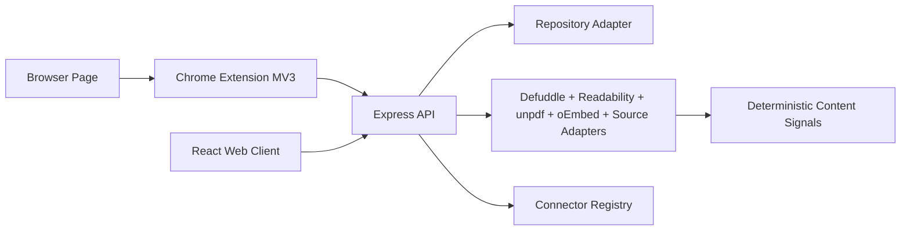

# Huntter Technical Design

## Architecture



## Project Layout

- `src/`: React/Vite web client.
- `server/`: Express API, Repository seam, JSON adapter, content recognition, and content signals.
- `server/repository.ts`: storage-facing interface for list, patch, delete, queued upsert, recognition result replacement, jobs, Capture Events, and connector state.
- `server/connectors.ts`: static connector definitions merged with stored connection state.
- `server/recognitionJobs.ts`: durable background recognition runner triggered on startup and enqueue.
- `server/repositories/jsonRepository.ts`: default development adapter.
- `server/repositories/sqliteRepository.ts`: opt-in local-first adapter with indexes and FTS maintenance.
- `shared/`: shared TypeScript types.
- `extension/`: Chrome Manifest V3 extension.
- `docs/`: product and technical design.

## Data Model

```ts
type LibraryItem = {
  id: string;
  url: string;
  canonicalUrl: string;
  title: string;
  sourceName: string;
  sourceType: "article" | "post" | "tweet" | "feishu" | "video" | "pdf" | "other";
  status: "unread" | "reading" | "read" | "archived";
  favorite: boolean;
  tags: string[];
  note?: string;
  summary: string;
  excerpt: string;
  readableText?: string;
  contentHtml?: string;
  coverImage?: string;
  favicon?: string;
  author?: string;
  publishedAt?: string;
  language?: string;
  wordCount?: number;
  savedAt: string;
  updatedAt: string;
  readingMinutes: number;
  confidence: number;
  enrichmentState: "processing" | "ready" | "partial" | "needs_connector" | "failed";
  sourceAccess?: "public" | "browser_snapshot" | "requires_auth" | "connector_required";
  sourceMessage?: string;
  requiredConnector?: "feishu" | "x";
  recognitionVersion?: number;
  recognizedAt?: string;
  recognitionDurationMs?: number;
  recognitionTiming?: {
    totalMs: number;
    sourceAdapterMs: number;
    contentSignalsMs: number;
    itemBuildMs: number;
  };
  contentHash?: string;
  extractor?: string;
};

type CaptureEvent = {
  id: string;
  itemId?: string;
  sourceUrl: string;
  canonicalUrl?: string;
  sourceType?: "article" | "post" | "tweet" | "feishu" | "video" | "pdf" | "other";
  captureMethod: "url_fetch" | "extension_snapshot" | "source_adapter" | "connector";
  snapshotBytes: number;
  resultState: "processing" | "ready" | "partial" | "needs_connector" | "failed";
  recognitionVersion?: number;
  recognitionDurationMs?: number;
  contentHash?: string;
  error?: string;
  createdAt: string;
};
```

## API

- `GET /api/health`
- `GET /api/items?q=&filter=&sourceType=&limit=&offset=`
- `POST /api/items`
- `PATCH /api/items/:id`
- `DELETE /api/items/:id`
- `POST /api/items/:id/enrich`
- `GET /api/capture-events?limit=`
- `GET /api/connectors`
- `GET /api/connectors/:provider`
- `PATCH /api/connectors/:provider`
- `DELETE /api/connectors/:provider`
- `POST /api/connectors/:provider/oauth/start`
- `GET /api/connectors/:provider/oauth/callback?code=&state=`
- `POST /api/connectors/:provider/sync`

`GET /api/items` returns the current page, global library stats, and page metadata. JSON and SQLite adapters share the same query semantics; SQLite executes search through FTS.

`GET /api/connectors` returns connector definitions plus stored connection state. `PATCH` records local connector state, `DELETE` clears mutable connector state and stored credentials, Feishu `POST /oauth/start` creates a short-lived OAuth state and PKCE authorization URL, and Feishu `/oauth/callback` exchanges the code for encrypted local credentials. Feishu `POST /sync` refreshes expired or near-expired Feishu access tokens before importing saved direct `/docx/{document_id}` items, legacy `/docs/{docToken}` items, and `/wiki/{node_token}` pages that resolve to docx or legacy doc through the official raw-content APIs, replacing URL-only `needs_connector` recognition results with connector provenance. Unsupported providers still fail explicitly with `409` for disconnected providers or `501` when provider import is not implemented. Permissioned sources use this model to explain exactly which connector is required.

`GET /api/capture-events` returns recent Capture Event diagnostics. Events include source URL, capture method, snapshot byte count, result state, timing, and error context, but never raw browser snapshot HTML or text.

## Ingestion Pipeline

1. Validate input at API boundary with Zod.
2. Normalize URL by removing fragments and known tracking parameters, then route it through the source adapter registry.
3. Let the adapter decide whether URL fetch, browser snapshot, or connector import is required.
4. Return an honest extraction state: `ready`, `partial`, `needs_connector`, or `failed`.
5. Pass captured text candidates through the pure quality gate.
6. Store sanitized parser HTML, browser selection HTML, or substantial browser snapshot HTML according to the winning extractor.
7. Stamp Recognition Version, recognized timestamp, and Content Hash.
8. Generate Content Signals only from content that was actually captured.
9. Build summary, tags, reading time, and provenance with deterministic local rules.
10. Store or merge duplicate by canonical URL.
11. Persist recognition work as a durable job so service restarts can recover `processing` items.
12. Record Capture Events for queued captures, completed recognition, manual refreshes, and failed recognition attempts.

## Source Adapter System

The app now uses source adapters instead of one universal parser.

- `server/sources/genericWeb.ts`: public pages and extension snapshots, using substantial selected text as a fast path, bounded HTML fetch, then Defuddle, lazy Readability fallback, metadata, and shared cover scoring.
- `server/sources/contentHtml.ts`: DOMPurify-backed sanitizer for parser HTML before storage.
- `server/sources/htmlFetch.ts`: public HTML fetch boundary for timeout, accepted content types, and max response bytes before parser work.
- `server/sources/contentQuality.ts`: pure quality gate for candidate selection, confidence, extraction state, and fallback decisions.
- `server/sources/extractedContentContract.ts`: runtime contract validation for Source Adapter output before item building.
- `server/sources/coverImage.ts`: shared cover scoring for Source Adapters, queued snapshot previews, oEmbed thumbnails, and metadata images.
- `server/sources/pdf.ts`: PDF text extraction with `unpdf`, bounded PDF download size, and browser snapshot fallback.
- `server/sources/video.ts`: YouTube/Vimeo oEmbed metadata extraction with transcript-aware partial state.
- `server/contentSignals.ts`: deterministic summary, tag, and reading-time derivation from Canonical Content and Sanitized Content HTML.
- `server/recognitionMetadata.ts`: recognition version and deterministic content hashing.
- `server/sources/x.ts`: public X post resolution through bounded oEmbed, selected-text fallback, quality-gated browser snapshot fallback, and connector-required fallback.
- `server/sources/feishu.ts`: Feishu URL detection, quality-gated browser snapshot capture, sanitized Canonical Content HTML, and connector-required fallback.
- `server/connectorAuth/feishuOAuth.ts`: Feishu OAuth authorization URL generation, callback token exchange, account label lookup, encrypted credential persistence, and sync-time access-token refresh.
- `server/connectorImport/feishuImport.ts`: Feishu direct docx URL, legacy doc URL, and wiki-node-to-docx/doc import through raw-content using encrypted connector credentials, replacing connector-required saved items and recording connector Capture Events.
- `server/connectorSecretBox.ts`: AES-GCM sealing for connector tokens before JSON or SQLite storage.
- `server/sources/registry.ts`: adapter routing.

This keeps source-specific behavior local and avoids pretending that every URL can be parsed like a public article.

Every adapter output is validated at the Source Adapter Registry seam before the item builder runs. The contract checks URL identity, required title/source fields, source type, extraction state, capture method, confidence range, optional URL/date fields, `contentHtml` safety, and state invariants such as `ready` requiring captured body content and `needs_connector` requiring `sourceAccess: "connector_required"`, `requiredConnector`, and a user-facing `sourceMessage`. Adapters should throw for real failures instead of returning fake `failed` content.

When an adapter cannot legally or technically read the target without user-granted access, it returns `needs_connector`, `sourceAccess: "connector_required"`, and a `requiredConnector` provider. The UI then renders the provider-specific connector state instead of showing a vague extraction error.

## Extension Design

The extension requests minimum practical permissions:

- `activeTab`: temporary access to the current page after user action.
- `scripting`: inject extractor only when saving.
- `storage`: save API base and draft preferences.
- `contextMenus`: right-click save link/page.

The extension sends page snapshots to `http://127.0.0.1:4317/api/items` by default. Its injected extractor prefers a focused content root over a blind full-page DOM slice, preserving metadata while avoiding huge shells, navigation, and sidebars where possible. It caps snapshot HTML, text, selected text, and image candidates before sending the request. The background worker exposes an internal save-tab message path so popup, context menu, keyboard shortcut, and tests can share the same extraction and POST behavior. The popup no longer owns duplicate extraction or POST logic; it collects UI inputs and delegates Save to the background path. After save, the web client refreshes only when the user clicks `Reload` or runs `/reload`; there is no frontend polling loop. Capture Events have a separate sidebar panel and `/events` command for manual diagnostics refresh.

`pnpm golden:extension` installs the real Manifest V3 extension into Chromium against isolated local API, web, and article fixture servers. The test temporarily patches only the copied manifest to grant random localhost ports, then verifies ready browser-snapshot recognition, `chrome.action.openPopup()` toolbar action launch, visible popup Save, Web manual Reload, Capture Events, stripped public `captureInput`, and no raw snapshot text in the event stream. Playwright does not expose Chrome's native toolbar bubble as an interactable page target in this workspace, so the Save click remains on the observable popup page that uses the same production popup UI and background save pipeline.

## Platform Strategy

- Generic web pages: extension capture + server extraction.
- PDFs: URL capture for text PDFs; OCR is a later adapter for scanned documents.
- YouTube/Vimeo videos: public oEmbed metadata now; transcript capture is a later adapter.
- X/Twitter: first-class URL save in MVP; later add OAuth and official Bookmarks API for sync.
- Reddit: use official API/embeds for deeper integrations; avoid broad scraping.

## Persistence

The development adapter uses `data/huntter-store.json`, behind `server/repository.ts`. The JSON adapter serializes in-process updates to reduce lost-write risk during background recognition. Production storage should move to SQLite or Postgres using the schema in `docs/DATABASE_DESIGN.md`.

Set `HUNTTER_REPOSITORY=sqlite` to use the SQLite adapter. It imports the JSON store on first empty startup unless `HUNTTER_SQLITE_IMPORT_JSON=false` is set.

## List Performance

The web client requests filtered pages from the API instead of loading the entire library and filtering in the browser. This keeps the UI responsive as the library grows and gives SQLite a clear place to apply indexes and FTS.

## Background Recognition

Saving an item writes the queued Saved Item, a durable recognition job, and a Capture Event. The job runner drains work on enqueue and on API startup; it does not require frontend polling. Completed, connector-required, partial, and failed recognition attempts record additional Capture Events. Failed jobs remain in storage with a retry time and can be claimed again by the next drain.

## Capture Diagnostics

The web client renders recent Capture Events in a compact sidebar panel. It shows result state, capture method, snapshot byte count, recognition duration, and error text when present. The panel is intentionally manual: users click its Reload button or run `/events` to refresh the event stream, which keeps the app consistent with the no-polling design while making extension save and background recognition states visible.

## Verification And CI

`pnpm verify` is the single local and hosted quality gate. It runs harness validation, TypeScript, ESLint, Prettier format check, deterministic fixtures, API smoke, browser golden, installed extension golden, visual golden, and production build. GitHub Actions mirrors that command in `.github/workflows/verify.yml` on pull requests and pushes to `main`.

ESLint uses the flat config format in `eslint.config.js` for TypeScript, React, Node-side scripts, and extension JavaScript. `pnpm lint` runs with `--max-warnings=0`, so warning regressions fail locally and in CI. The only scoped fast-refresh export exception is for shadcn UI primitives under `src/components/ui/`, where variant helpers are part of the local component API; app code keeps the stricter export check. Prettier is configured through `.prettierrc.json` and `.prettierignore`; generated and machine-state artifacts such as `feature-list.json`, `pnpm-lock.yaml`, `dist/`, `data/`, and visual screenshot output are excluded from formatting checks.

The CI workflow uses Node 22 because the SQLite adapter currently depends on Node's built-in `node:sqlite`. It installs Playwright Chromium with system dependencies and runs verification under Xvfb so the installed Manifest V3 extension golden can launch headed Chromium.

`pnpm golden:visual` starts isolated local API and web servers, seeds deterministic ready and connector-needed items, checks desktop and mobile layouts, verifies reader iframe content, asserts no page-level horizontal overflow, and writes PNG screenshots to `artifacts/visual/` for human review. When a matching platform baseline exists under `tests/visual-baselines/<platform>/`, it compares screenshots with `pixelmatch` and writes failure diffs to `artifacts/visual/diffs/`. Baseline refresh is explicit through `pnpm golden:visual:update`. Dynamic date and duration values remain visible in the product UI but are hidden during visual screenshots through `data-visual-dynamic` markers so timing noise does not invalidate layout comparisons.

The committed baseline set currently covers `win32-x64`. GitHub Actions temporarily allows a missing `linux-x64` baseline with `HUNTTER_VISUAL_ALLOW_MISSING_BASELINE=true`; remove that allowance after generating Linux baselines from the hosted runner environment.

## Reprocessing Strategy

Recognition output carries `recognitionVersion`, `recognizedAt`, `recognitionDurationMs`, `recognitionTiming`, and `contentHash`. `recognitionTiming` records total, Source Adapter, Content Signals, and item-build milliseconds so parser and adapter changes can be compared without adding AI or external telemetry. Saved Items also keep an internal `captureInput` copy of the original URL/snapshot used for recognition. Future parser upgrades can query items by old version, re-run recognition against the original captured material, compare content hashes, measure parser latency, and preserve workflow fields through the Repository merge path.

`captureInput` is storage-facing only. The API strips it from item responses so large browser snapshots do not bloat library listing, detail rendering, or extension save responses.

When duplicate saves merge, a browser-snapshot `captureInput` is stronger than URL-only input and is preserved. This prevents a later URL-only save from destroying the material needed to refresh a permissioned capture.

Stored `captureInput` and queued recognition job input are normalized through `server/captureInput.ts` with explicit budgets for title, HTML, text, selected text, excerpt, favicon, and image candidates. This keeps refresh/reprocessing deterministic without letting arbitrary browser snapshots grow the database unbounded.

## Canonical URL Dedupe

`normalizeUrl` removes hash fragments and known tracking parameters while preserving meaningful query parameters. The Repository dedupes queued items by the resulting `canonicalUrl`, which keeps newsletter/social campaign variants from creating duplicate Saved Items.

## Reader HTML Safety

`contentHtml` is sanitized before storage with DOMPurify's HTML profile, no inline styles, and named property isolation. The web client renders it inside a sandboxed `srcDoc` iframe with no script, form, popup, or same-origin privileges. The reader document adds local typography only; it does not mutate the sanitized source markup before render.
